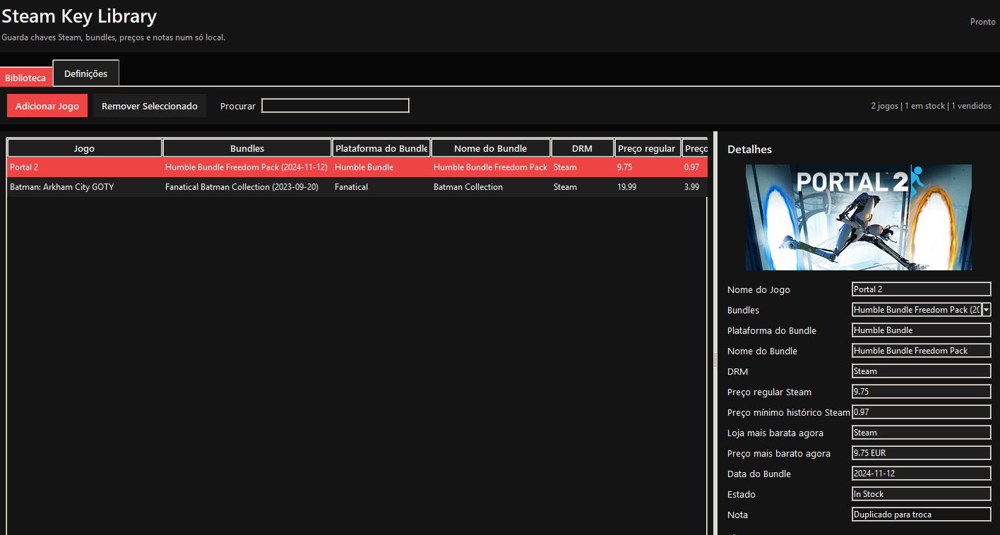
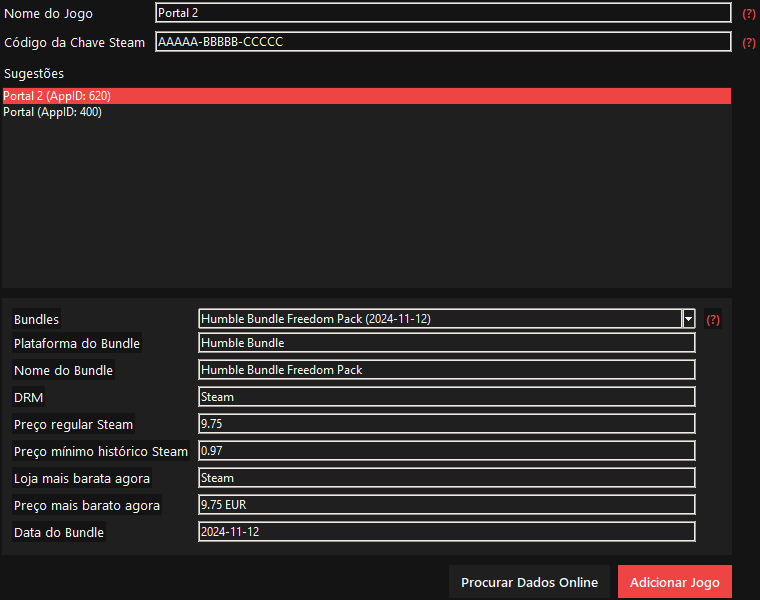
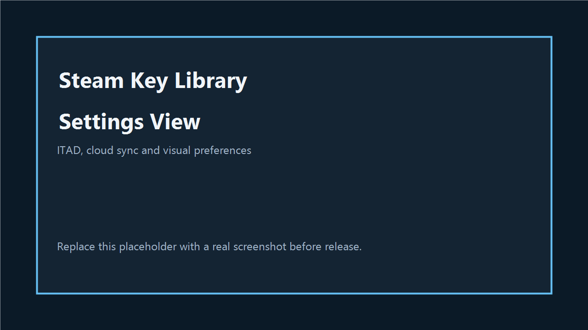

# Steam Key Library

Aplicacao desktop em Python + Tkinter para gerir chaves Steam, registar origem de bundles e obter dados de preco da Steam/ITAD.

## Funcionalidades

- Biblioteca local de jogos e multiplas chaves por jogo
- Pesquisa na Steam com sugestoes e deteccao automatica de app
- Dados de preco da Steam API (preco normal + minimo historico)
- Historico de bundles via ITAD (OpenAPI) com feed fallback opcional
- Suporte de sincronizacao cloud (JSONBin, links Google Drive, endpoint JSON customizado)
- Interface em Ingles e Portugues (Portugal)
- Multiplos temas visuais (Steam, Dark, White, Black/Red)

## Requisitos

- Python 3.10+
- pip

Dependencias:

- requests
- Pillow

## Inicio Rapido

```powershell
python -m venv .venv
. .venv\Scripts\Activate.ps1
pip install requests Pillow
python steamkeylibrary.py
```

Launcher alternativo no Windows:

- Abrir [OpenSteamKeyLibrary.bat](OpenSteamKeyLibrary.bat)

## Configuracao

As definicoes ficam guardadas localmente e sao editadas na tab Settings da aplicacao.

Campos sensiveis (nao fazer commit com valores reais):

- ITAD API key
- Cloud URL/auth header
- Fallback provider auth header

Variaveis de ambiente suportadas:

```powershell
$env:ITAD_API_KEY = "<your_itad_api_key>"
$env:ITAD_COUNTRY = "PT"
$env:CLOUD_SAVE_URL = "https://api.jsonbin.io/v3/b/YOUR_BIN_ID"
$env:CLOUD_AUTH_HEADER = "X-Master-Key <your_key>"
$env:BARTER_BUNDLES_URL = "https://example.com/feeds/bundles?appid={appid}&format=json"
$env:BARTER_AUTH_HEADER = "Bearer <token>"
```

## Ficheiros de Dados

A aplicacao cria/usa estes ficheiros locais:

- games.json
- settings.json
- itad_cache.json
- steam_applist.json

Para repositorios publicos, estes ficheiros sao ignorados por defeito no [.gitignore](.gitignore).

## Capturas de Ecra

Adiciona as capturas em [docs/screenshots](docs/screenshots) e mantem estes nomes para preview automatico no README:

- [Vista da biblioteca](docs/screenshots/library.png)
- [Dialogo de adicionar jogo](docs/screenshots/add-game.png)
- [Vista de definicoes](docs/screenshots/settings.png)





## Build EXE (Windows)

```powershell
.\build_exe.bat
```

Output:

- dist/SteamKeyLibrary.exe

## Checklist de Privacidade e Publicacao

Antes de publicar:

1. Manter chaves/tokens pessoais apenas nas definicoes locais (nunca fazer commit).
2. Manter ficheiros locais de biblioteca/cache fora do Git.
3. Rodar qualquer chave que tenha sido exposta anteriormente.

## Licenca

MIT - ver [LICENSE](LICENSE)
